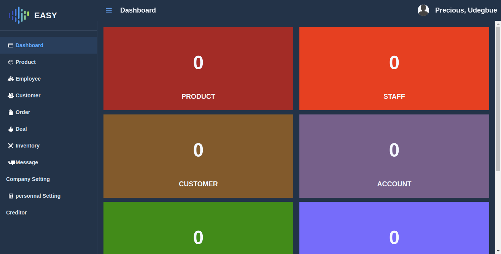

# Team-067-A-Backend
<!--
*** Thanks for checking out this README Template. If you have a suggestion that would
*** make this better, please fork the repo and create a pull request or simply open
*** an issue with the tag "enhancement".
*** Thanks again! Now go create something AMAZING! :D
-->

<!-- PROJECT SHIELDS -->
<!--
*** I'm using markdown "reference style" links for readability.
*** Reference links are enclosed in brackets [ ] instead of parentheses ( ).
*** See the bottom of this document for the declaration of the reference variables
*** for contributors-url, forks-url, etc. This is an optional, concise syntax you may use.
*** https://www.markdownguide.org/basic-syntax/#reference-style-links
-->
[![Contributors][contributors-shield]][contributors-url]
[![Forks][forks-shield]][forks-url]
[![Stargazers][stars-shield]][stars-url]
[![Issues][issues-shield]][issues-url]

<!-- PROJECT LOGO -->
 

  

  

  

  <h3 align="center">SDG Easy CRM</h3>

  

    This is the Easy Crm project of the andela/facebook build for SDG program.
     
    <a href="https://github.com/evabanegacom/Team-067-A-Backend"><strong>Explore the docs »</strong></a>
     
     
    <a href="https://github.com/evabanegacom/Team-067-A-Backend/issues">Report Bug</a>
    ·
    <a href="https://github.com/evabanegacom/Team-067-A-Backend/issues">Request Feature</a>
  

<!-- TABLE OF CONTENTS -->
## Table of Contents

* [About the Project](#about-the-project)
  * [Built With](#built-with)
* [Contact](#Authors)
* [Acknowledgements](#acknowledgements)
* [How it works](#How-it-works)
* [Application Features](#Application-Features)

<!-- ABOUT THE PROJECT -->
## About The Project

This is a software for small organisations/business that focuses in Customer RElations Management,
Asset Management and Account management.
The essence of this software is to help small orgainsations with data and insight on how their business(es) are performing and manage them on the fly electronically. IT is connected to a database and information can be gotten or obtained at any point in time. This software fits well into mobile devices and can be installed as a mobile app.anyone can use it as it doesn't require technical skill to navigate

## LIVE DEMO
 [Link to live demo](https://sdgcrm.herokuapp.com/) 

<!-- BUILD WITH -->
## Built With
This project was built using these technologies.
* Javascript
* HTML
* CSS
* Java
* Spring

<!-- ABOUT THE PROJECT -->
## Getting Started
- To get a local copy up and running follow these simple example steps.

#### Clone the repository to run the app.
- $ `git clone git@github.com/BuildForSDGCohort2/Team-067-A-Backend.git`

<!-- CONTACT -->

👤 **Precious**

- Github: [@Precious](https://github.com/evabanegacom)

<!-- Application Features -->

## Application Features
* Easy Intuitive UI - Loads fast and works reliable regardless of network connection
* PWA- progressive web app - Native app experience. EasyCRM can be installed as an application on      desktop, ios, and android.
* Easy to use- Easy CRM was designed for the very basic user and use case. its was designed to be very easy to use and understand.
* Security- EasyCRM is very secure
* Lightweight- EasyCRM is very lightweight. 
* Internationalization [TODO]- EasyCRM would be able to be translated to all major african languages to cater for non-english speaking users. Languages like Hausa, Igbo, Yoruba, Swahili amongst others.
* Product Management- Small and large businesses can manage their product inventory effectively.
* Orders Management- Small and large businesses can manage their orders/deal effectively.
* Invoicing [TODO]
* User profile management
* Customer/Client Management
* Asset Management [TODO]
* In-App Messaging [TODO]

ERD Sketch Developed using <a href="https://www.jetbrains.com/idea/">Intellij IDE</a>

<!-- ACKNOWLEDGEMENTS -->
## Acknowledgements
* [Andela](https://www.andela.com/)
* [Facebook](https://www.facebook.com/)

## Show your support

Give a ⭐️ if you like this project!

<!-- MARKDOWN LINKS & IMAGES -->
<!-- https://www.markdownguide.org/basic-syntax/#reference-style-links -->
[contributors-shield]: https://img.shields.io/github/contributors/evabanegacom/Team-067-A-Backend.svg?style=flat-square
[contributors-url]: https://github.com/evabanegacom/Team-067-A-Backend/graphs/contributors
[forks-shield]: https://img.shields.io/github/forks/evabanegacom/Team-067-A-Backend.svg?style=flat-square
[forks-url]: https://github.com/evabanegacom/Team-067-A-Backend/network/members
[stars-shield]: https://img.shields.io/github/stars/evabanegacom/Team-067-A-Backend.svg?style=flat-square
[stars-url]: https://github.com/evabanegacom/Team-067-A-Backend/stargazers
[issues-shield]: https://img.shields.io/github/issues/evabanegacom/Team-067-A-Backend.svg?style=flat-square
[issues-url]: https://github.com/evabanegacom/Team-067-A-Backend/issues

## 📝 License

This project is [MIT](https://opensource.org/licenses/MIT) licensed.
